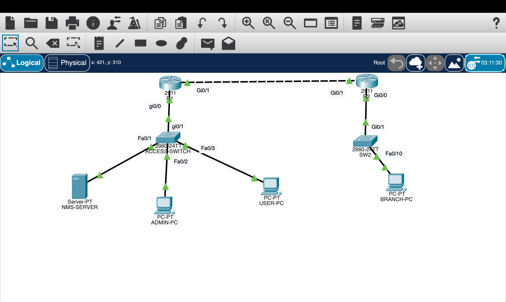

# Enterprise Network Operations AAA Lab

An enterprise operations lab built in Cisco Packet Tracer 9.0.1 to evaluate foundational services, centralized administrative access, failure behavior, and simulator boundaries.

## What this project demonstrates

- VLAN segmentation and 802.1Q router-on-a-stick routing
- Static intersite routing and DHCP relay
- DNS, NTP, Syslog, SNMPv2c, and SSH management services
- RADIUS authentication on SW2
- TACACS+ authentication, EXEC authorization, and accounting on R2
- Rejection versus server-unavailable behavior
- Local break-glass fallback and privilege elevation
- Evidence-driven testing and simulator-limit documentation

## Topology

| Segment | Purpose | Subnet / gateway |
|---|---|---|
| VLAN 10 | Users | `192.168.10.0/24` / `192.168.10.1` |
| VLAN 99 | Management and NMS | `192.168.99.0/24` / `192.168.99.1` |
| VLAN 20 | Branch users | `192.168.20.0/24` / `192.168.20.1` |
| VLAN 199 | Branch management | `192.168.199.0/24` / `192.168.199.1` |
| VLAN 999 | Native, unused | No Layer 3 address |
| R1–R2 | Routed transit | `10.0.12.0/30` |

## Key findings

1. Valid centralized credentials allowed SSH access.
2. An explicit RADIUS or TACACS+ rejection did **not** invoke the local method.
3. When the AAA service was unavailable, the local `admin` account provided break-glass access.
4. Packet Tracer sessions entered user EXEC, requiring `enable` before privilege level 15 was confirmed.
5. TACACS+ packets were visible in Simulation mode, but PDU detail was insufficient to classify every AAA function.
6. RADIUS accounting commands were accepted, but Server-PT exposed no usable accounting records.

## Documentation

- [Network design](Network-Design.md)
- [Configuration guide](Configuration-Guide.md)
- [Verification and results](Verification.md)
- [Troubleshooting](Troubleshooting.md)
- [RADIUS versus TACACS+](RADIUS-vs-TACACS.md)
- [CCNA v2.0 objective mapping](CCNA-v2.0-Objective-Mapping.md)
- [Lessons learned](Lessons-Learned.md)
- [Evidence index](evidence/README.md)

## Security notice

Only sanitized configurations are included. Shared secrets, password hashes, SNMP community strings, and server credentials use placeholders. Original `.pkt` files are excluded because their credentials can be inspected. Create demonstration-only copies before public release.

## Scope note

This is an educational simulation, not a production deployment. Production designs should use SNMPv3, encrypted secret management, restricted management-plane access, redundant AAA servers, command authorization, and verified accounting logs.
